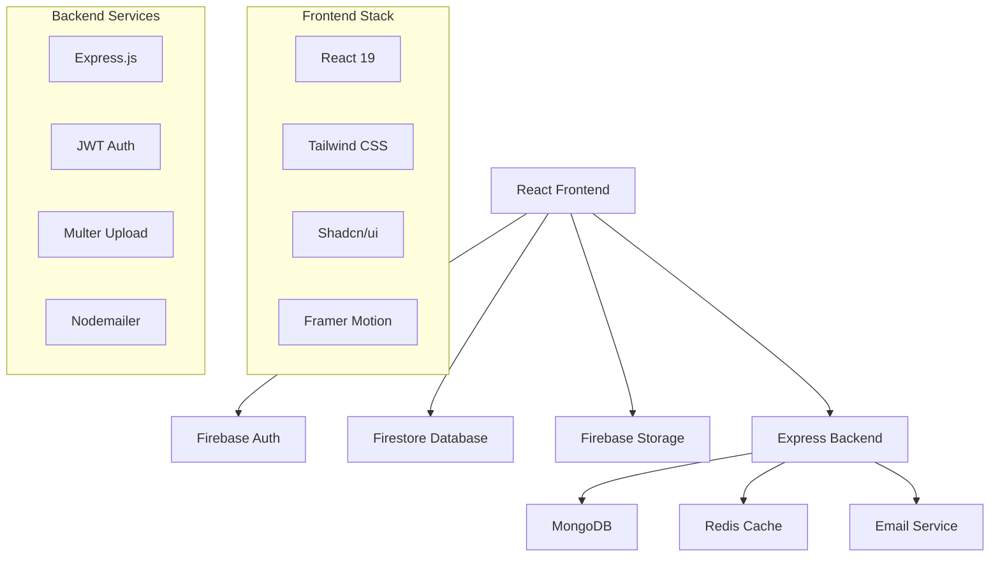

# 🎓 SwapNest - Campus Marketplace

<div align="center">


**A modern, full-stack campus marketplace connecting students to buy, sell, rent, and donate items within their community.**

[](https://reactjs.org/)
[](https://firebase.google.com/)
[](https://tailwindcss.com/)
[](https://vitejs.dev/)

[🚀 Live Demo]([https://swapnest.vercel.app](https://swap-nest-self.vercel.app/)) • [📖 Documentation](https://github.com/SwapNest-Official/SwapNest/wiki) • [🐛 Report Bug](https://github.com/SwapNest-Official/SwapNest/issues) • [💡 Request Feature](https://github.com/SwapNest-Official/SwapNest/issues)

</div>

---

## 🌟 What is SwapNest?

SwapNest is a comprehensive campus marketplace platform designed specifically for college students. It enables seamless transactions between students for textbooks, electronics, furniture, and more, fostering a sustainable campus economy while building community connections.

### 🎯 **Core Mission**
- **Reduce Waste**: Give items a second life through campus trading
- **Save Money**: Help students find affordable alternatives to expensive retail
- **Build Community**: Connect students through shared interests and needs
- **Promote Sustainability**: Encourage reuse and reduce campus waste

---

## ✨ Key Features

### 🛍️ **Smart Marketplace**
- **Multi-Transaction Types**: Buy, Sell, Rent, or Donate items
- **Advanced Search**: Filter by category, condition, price range, and keywords
- **Real-time Updates**: Live inventory tracking and availability
- **Smart Recommendations**: AI-powered suggestions based on user behavior

### 💬 **Integrated Communication**
- **Real-time Chat**: Built-in messaging system with Firebase
- **Product Context**: Chat includes item details and images
- **Unread Notifications**: Track message status and respond promptly
- **Mobile-Optimized**: Seamless chat experience across all devices

### 🎨 **Modern User Experience**
- **Responsive Design**: Mobile-first approach with tablet and desktop optimization
- **Dark/Light Mode**: Theme switching with persistent preferences
- **Smooth Animations**: Framer Motion powered micro-interactions
- **Progressive Loading**: Staggered content loading for better performance

### 🔐 **Secure & Reliable**
- **Firebase Authentication**: Secure user management and session handling
- **Real-time Database**: Firestore for instant data synchronization
- **File Upload Security**: Safe image handling with Firebase Storage
- **Rate Limiting**: Backend protection against abuse

---

## 🏗️ Architecture Overview



---

## 🚀 Tech Stack

### **Frontend Technologies**
| Technology | Version | Purpose |
|------------|---------|---------|
| **React** | 19.0.0 | Modern UI framework with hooks |
| **Vite** | 6.2.0 | Lightning-fast build tool |
| **Tailwind CSS** | 3.4.17 | Utility-first styling |
| **Shadcn/ui** | Latest | Accessible component library |
| **Framer Motion** | 12.4.10 | Smooth animations |
| **React Router** | 7.3.0 | Client-side routing |
| **Lucide React** | 0.479.0 | Consistent icon system |

### **Backend & Services**
| Service | Purpose | Integration |
|---------|---------|-------------|
| **Firebase Auth** | User authentication | Secure login/signup |
| **Firestore** | Real-time database | Live data sync |
| **Firebase Storage** | File management | Image uploads |
| **Express.js** | API server | RESTful endpoints |
| **MongoDB** | Data persistence | User and product data |
| **Redis** | Caching layer | Performance optimization |
| **Nodemailer** | Email service | Notifications |

---

## 📱 Screenshots

<div align="center">

### 🏠 Home Dashboard


### 💬 Chat Interface


### 📱 Mobile Experience


</div>

---

## 🛠️ Installation & Setup

### **Prerequisites**
- Node.js 18+ 
- npm or yarn
- Firebase account
- MongoDB (local or cloud)

### **Quick Start**

1. **Clone the repository**
   ```bash
   git clone https://github.com/SwapNest-Official/SwapNest.git
   cd SwapNest
   ```

2. **Install dependencies**
   ```bash
   npm install
   cd backend && npm install
   ```

3. **Environment Configuration**
   
   Create `.env` in the root directory:
   ```env
   # Firebase Configuration
   VITE_FIREBASE_API_KEY=your_api_key
   VITE_FIREBASE_AUTH_DOMAIN=your_auth_domain
   VITE_FIREBASE_PROJECT_ID=your_project_id
   VITE_FIREBASE_STORAGE_BUCKET=your_storage_bucket
   VITE_FIREBASE_MESSAGING_SENDER_ID=your_sender_id
   VITE_FIREBASE_APP_ID=your_app_id
   
   # Backend Configuration
   MONGODB_URI=your_mongodb_connection_string
   JWT_SECRET=your_jwt_secret
   REDIS_URL=your_redis_url
   ```

4. **Firebase Setup**
   - Create a new Firebase project
   - Enable Authentication, Firestore, and Storage
   - Configure authentication providers
   - Set up Firestore security rules

5. **Start Development**
   ```bash
   # Frontend (Terminal 1)
   npm run dev
   
   # Backend (Terminal 2)
   cd backend && npm run dev
   ```

6. **Access the Application**
   - Frontend: `http://localhost:5173`
   - Backend API: `http://localhost:5000`

---

## 📂 Project Structure

```
SwapNest/
├── 📁 src/                          # Frontend source code
│   ├── 📁 components/               # Reusable UI components
│   │   └── 📁 ui/                  # Shadcn/ui components
│   ├── 📁 contexts/                # React context providers
│   │   ├── ThemeContext.jsx        # Dark/light mode
│   │   └── OffersCountContext.jsx  # Real-time offers tracking
│   ├── 📁 chatSystem/              # Real-time messaging
│   │   ├── chatInterface.jsx       # Main chat component
│   │   ├── chatList.jsx           # Chat conversations
│   │   └── chatRoom.jsx           # Individual chat room
│   ├── 📁 ecommerce/               # Product management
│   │   ├── CategoryPage.jsx        # Category browsing
│   │   ├── SearchResults.jsx       # Search functionality
│   │   └── Favorites.jsx          # User favorites
│   ├── 📁 ProductDetails/          # Product information
│   │   ├── ProductDetails.jsx      # Main product view
│   │   ├── ImageViewer.jsx         # Image gallery
│   │   └── RightColumn.jsx         # Product actions
│   ├── 📁 authentication/          # User auth
│   │   ├── login.jsx              # Login page
│   │   └── signup.jsx             # Registration page
│   └── 📁 firebase/                # Firebase configuration
│       └── config.js              # Firebase setup
├── 📁 backend/                      # Backend API
│   ├── 📁 models/                  # Database models
│   │   ├── User.js                # User schema
│   │   ├── Product.js             # Product schema
│   │   └── Order.js               # Order schema
│   ├── 📁 routes/                  # API endpoints
│   │   ├── auth.js                # Authentication routes
│   │   ├── products.js            # Product management
│   │   ├── users.js               # User operations
│   │   └── orders.js              # Order processing
│   ├── 📁 middleware/              # Custom middleware
│   │   └── auth.js                # JWT authentication
│   └── 📁 utils/                   # Utility functions
│       └── redis.js               # Redis configuration
└── 📁 public/                      # Static assets
```

---

## 🎯 Core Features Deep Dive

### **🛒 Product Management**
- **Multi-Category Support**: Electronics, Books, Clothing, Furniture, Sports
- **Condition Tracking**: New, Like New, Good, Fair with visual indicators
- **Image Gallery**: Multiple photos with zoom and swipe functionality
- **Price Flexibility**: Fixed pricing, rental rates, or free donations
- **Availability Status**: Real-time inventory tracking

### **🔍 Advanced Search & Filtering**
- **Text Search**: Product titles, descriptions, and tags
- **Category Filtering**: Dynamic category selection with subcategories
- **Price Range**: Min/max price filtering with currency support
- **Condition Filtering**: Filter by item condition and quality
- **Location-Based**: Campus-specific item discovery
- **Sorting Options**: Price, date, popularity, and relevance

### **💬 Real-time Communication**
- **Instant Messaging**: WebSocket-like real-time updates
- **Product Context**: Chat includes product details and images
- **Message Status**: Read receipts and delivery confirmations
- **File Sharing**: Image and document sharing in chat
- **Notification System**: Push notifications for new messages
- **Chat History**: Persistent conversation storage

### **👤 User Experience**
- **Profile Management**: Complete user profiles with ratings
- **Favorites System**: Save and organize favorite items
- **Transaction History**: Track all buy/sell activities
- **Rating System**: Rate and review other users
- **Privacy Controls**: Manage visibility and contact preferences

---

## 🚀 Deployment

### **Frontend Deployment (Vercel)**
```bash
# Install Vercel CLI
npm i -g vercel

# Deploy
vercel --prod
```

### **Backend Deployment (Railway/Heroku)**
```bash
# Set environment variables
heroku config:set MONGODB_URI=your_mongodb_uri
heroku config:set JWT_SECRET=your_jwt_secret

# Deploy
git push heroku main
```

### **Firebase Configuration**
```javascript
// Production Firebase rules
rules_version = '2';
service cloud.firestore {
  match /databases/{database}/documents {
    match /{document=**} {
      allow read, write: if request.auth != null;
    }
  }
}
```

---

## 🤝 Contributing

We welcome contributions from the community! Here's how you can help:

### **Ways to Contribute**
- 🐛 **Bug Reports**: Found a bug? Let us know!
- 💡 **Feature Requests**: Have an idea? We'd love to hear it!
- 🔧 **Code Contributions**: Submit pull requests for improvements
- 📖 **Documentation**: Help improve our docs and guides
- 🎨 **Design**: Contribute to UI/UX improvements

### **Development Workflow**
1. Fork the repository
2. Create a feature branch: `git checkout -b feature/amazing-feature`
3. Make your changes and test thoroughly
4. Commit with a clear message: `git commit -m 'Add amazing feature'`
5. Push to your branch: `git push origin feature/amazing-feature`
6. Open a Pull Request with a detailed description

### **Code Standards**
- Follow React best practices and hooks patterns
- Use TypeScript for new components when possible
- Maintain responsive design principles
- Write meaningful commit messages
- Test on multiple devices and browsers
- Ensure accessibility compliance

---

## 📊 Performance Metrics

<div align="center">

| Metric | Score | Status |
|--------|-------|--------|
| **Lighthouse Performance** | 95+ | ✅ Excellent |
| **First Contentful Paint** | < 1.5s | ✅ Fast |
| **Largest Contentful Paint** | < 2.5s | ✅ Good |
| **Cumulative Layout Shift** | < 0.1 | ✅ Stable |
| **Time to Interactive** | < 3.5s | ✅ Responsive |

</div>

---

## 🔒 Security & Privacy

- **Data Encryption**: All sensitive data encrypted in transit and at rest
- **Authentication**: Secure JWT-based authentication with Firebase
- **Input Validation**: Comprehensive input sanitization and validation
- **Rate Limiting**: API protection against abuse and DDoS
- **Privacy Controls**: User data control and GDPR compliance
- **Secure File Upload**: Image validation and secure storage

---

## 📈 Roadmap

### **Q1 2024**
- [ ] Mobile app development (React Native)
- [ ] Advanced recommendation engine
- [ ] Payment integration (Stripe/PayPal)
- [ ] Multi-language support

### **Q2 2024**
- [ ] AI-powered item categorization
- [ ] Video product previews
- [ ] Campus-specific features
- [ ] Advanced analytics dashboard

### **Q3 2024**
- [ ] Social features (following, feeds)
- [ ] Group buying functionality
- [ ] Integration with campus systems
- [ ] Advanced search with ML

---

## 📞 Support & Community

<div align="center">

### **Get Help**
- 📧 **Email**: support@swapnest.com
- 💬 **Discord**: [Join our community](https://discord.gg/swapnest)
- 📱 **Twitter**: [@SwapNestApp](https://twitter.com/SwapNestApp)

### **Resources**
- 📖 **Documentation**: [Wiki](https://github.com/SwapNest-Official/SwapNest/wiki)
- 🐛 **Bug Reports**: [Issues](https://github.com/SwapNest-Official/SwapNest/issues)
- 💡 **Feature Requests**: [Discussions](https://github.com/SwapNest-Official/SwapNest/discussions)
- 📺 **Video Tutorials**: [YouTube Channel](https://youtube.com/swapnest)

</div>

---

## 📄 License

This project is licensed under the **MIT License** - see the [LICENSE](LICENSE) file for details.

---

## 🙏 Acknowledgments

Special thanks to the amazing open-source community and the following projects:

- **React Team** for the incredible framework
- **Firebase** for providing robust backend services
- **Tailwind CSS** for the utility-first CSS framework
- **Shadcn/ui** for beautiful, accessible components
- **Vite** for the lightning-fast development experience
- **All Contributors** who help make SwapNest better every day

---

<div align="center">

**Built with ❤️ for the campus community**

*SwapNest - Where campus commerce meets modern technology*

[](https://github.com/SwapNest-Official/SwapNest/stargazers)
[](https://github.com/SwapNest-Official/SwapNest/network)
[](https://github.com/SwapNest-Official/SwapNest/issues)

</div>
